# University of Sheffield Research Software Survey (2020)

Robert Turner, Paul Richmond, University of Sheffield RSE Team
September, 2021

# Thank you!

Thanks for coming, thanks to the conference organisers, thanks to the RSE team at Sheffield, Paul Richmond in particular.

# About me

{ height=256px }

Mix of software engineering and research experience.

# RSE at Sheffield

{ height=256px }

13 RSEs, 35 projects / year worth ~£11m total

# Why survey?

::: incremental

* Improve our practise and procedures.
* Prioritise our resources.
* Data-driven advocacy.

:::

# I'm scared of surveys

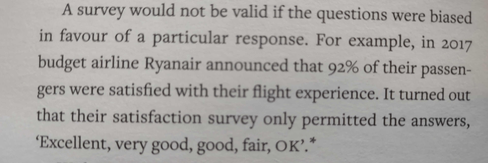{ height=256px }

from *"The Art of Statistics: Learning from Data, David Spiegelhalter, 2020 paperback"*

# Reasoning

from *"The Art of Statistics: Learning from Data, David Spiegelhalter, 2020 paperback"*

# Sources

* Data and analysis software <https://github.com/RSE-Sheffield/sssurvey>.
* Report in `.pdf` format <https://github.com/RSE-Sheffield/sssurvey/releases/download/latest/report.pdf>.

# The Survey

::: incremental

* Based on surveys carried out [nationally](https://zenodo.org/record/1183562#.YMnQFahKiUk) in 2014 and at the [University of Southampton](https://zenodo.org/record/3569558#.YRZfS4hKiUl) in 2019, led by Simon Hettrick.
* Asked about "demographics", use and development of software, training and funding.

:::

# Analysis

*Generally, "non responses" to optional (O) questions were ignored. Mandatory questions are marked (M).*

::: incremental

* Data anonymised manually.
* Cleaned and annotated using Python scripts (with some manual decisions).
* Plotted charts using Jupyter notebook.
* Presentation and report written in markdown.
* Outputs built using pandoc / GitHub actions.

:::

# Sample characteristics

::: incremental

* This survey went to all PhD students and research staff with a prize incentive.
* 382 respondents.
* A 2019 Southampton survey went to *"all staff employed on an ERE contract (Education, Research and Enterprise) and all PhD students"* with a prize incentive. As surveys were sent out on a faculty by faculty basis, it was possible to report a response rate of between 8% and 11% for all faculties.
* 2014 national survey - it is not clear what sampling strategy was used.

:::

# Faculty

# Funders

# Job

# Importance of research software

:::::::::::::: {.columns}
::: {.column width="50%"}

:::
::: {.column width="50%"}

1 *"Not at all"*, to 5 *"Vital"*
:::
::::::::::::::

# Software development practise

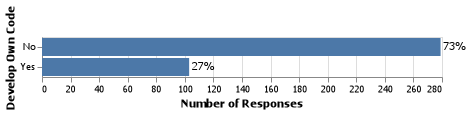

# Software Importance

::: incremental

* 91% of respondents use research software ([92% nationally](https://zenodo.org/record/1183562#.YMnQFahKiUk)).
* 65% report that software is vital to their research (nationally, 69% report that "It would not be practical to conduct my work without software").
* 27% develop their own code ([56% nationally](https://zenodo.org/record/1183562#.YMnQFahKiUk)).

:::

# Sufficiency of training

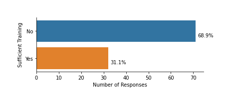

# Awareness around key skills

:::::::::::::: {.columns}
::: {.column width="33%"}
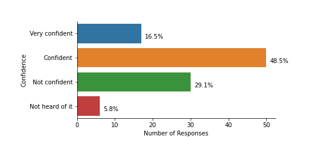
:::
::: {.column width="33%"}
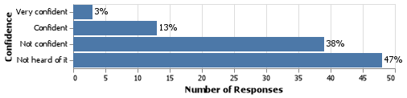
:::
::: {.column width="33%"}
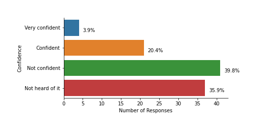
:::
::::::::::::::

# Current level of support

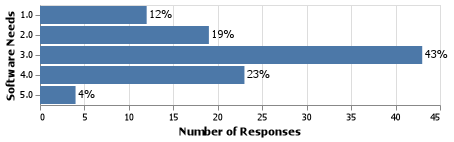

1: *"poor"* to 5: *"excellent"*

# Training and funding

::: incremental

* 69% (of the 27% subset who responded to this question) feel they have **not had sufficient training** to develop reliable software.
* Current level of support for software development is questionable.

:::

# Funding for Software Development

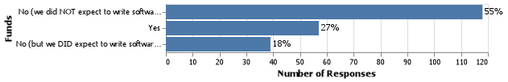

# Funding

::: incremental

* Of the 54% of respondents who are involved with writing funding proposals, 45% expected to write software as part of the proposal.
* Of those who expected to write software, 40% did not request funding for this (compared to [20%, nationally](https://zenodo.org/record/1183562#.YMnQFahKiUk)).

:::

# Staffing of software development

:::::::::::::: {.columns}
::: {.column width="50%"}
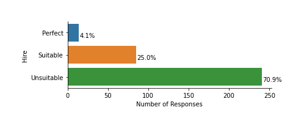
:::
::: {.column width="50%"}
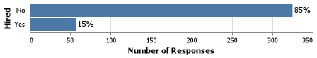
:::
::::::::::::::

# Hiring practise

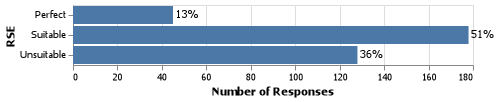

# High Performance Computing

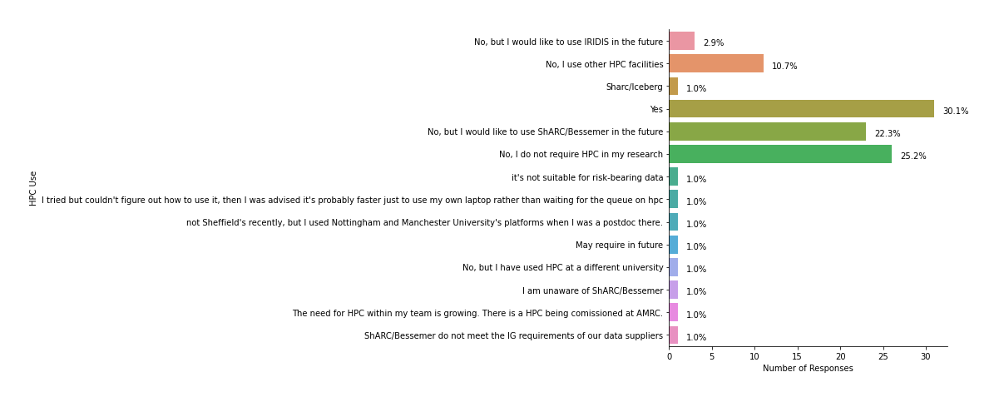

# Licensing and commercialisation

:::::::::::::: {.columns}
::: {.column width="50%"}
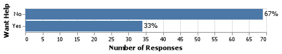
:::
::: {.column width="50%"}

:::
::::::::::::::

# Actions - training

::: incremental

* Provide training / support to increase researcher confidence with version control, continuous integration and unit testing.
* **Investigate why 69% of respondents feel they have not had sufficient training. What training is needed? How much?**

:::

# Actions

::: incremental

* Investigate why participants responded as they did to a question about level of support for software development.
* Provide additional support to researchers to make research software outputs not intended for commercialisation freely available.
* Discover if any action can be taken to help researchers who would like to use University of Sheffield HPC but don't currently use to do so.
* **Advocate for researchers to include costs for software development in their funding applications.**

:::

# Future work (Final Slide)

::: incremental

* Can we say if responses are different for different funders, research subjects using subgroup analysis?
* Does the national / international picture need to be revisited?

:::
