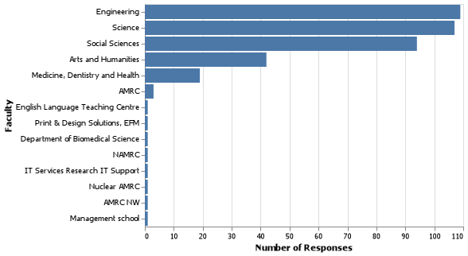
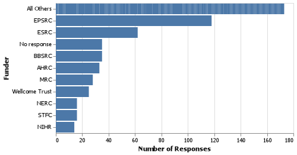
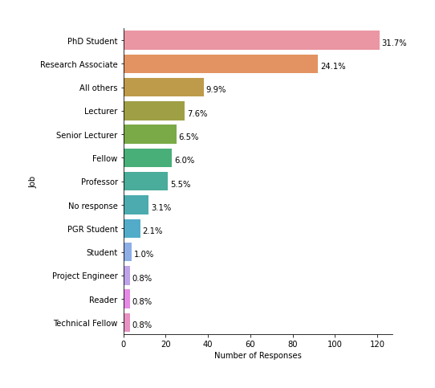
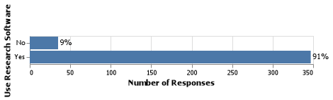
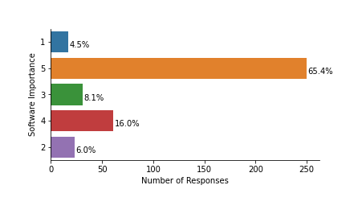

% University of Sheffield Research Software Survey (2020) - WORK IN PROGRESS
% Robert Turner, Paul Richmond, University of Sheffield RSE Team
% September, 2021

# Major Findings

::: incremental

* 382 respondents.
* 91% of respondents use research software ([92% nationally](https://zenodo.org/record/1183562#.YMnQFahKiUk)).
* 65% report that software is vital to their research (nationally, 69% report that "It would not be practical to conduct my work without software").
* 27% develop their own code ([56% nationally](https://zenodo.org/record/1183562#.YMnQFahKiUk)).
* 69% (of the 27% subset who responded to this question) feel they have **not had sufficient training** to develop reliable software.
* Of the 54% of respondents who are involved with writing funding proposals, 45% expected to write software as part of the proposal.
* Of those who expected to write software, 40% did not request funding for this (compared to [20%, nationally](https://zenodo.org/record/1183562#.YMnQFahKiUk)).

:::

# Recommendations

::: incremental

* Investigate why 69% of respondents feel they have not had sufficient training.
* Provide training / support to increase researcher confidence with version control, continuous integration and unit testing.
* Investigate why participants responded as they did to a question about level of support for software development. Create a target for this and monitor performance against it.
* Provide additional support to researchers to make research software outputs not intended for commercialisation freely available.
* Discover if any action can be taken to help researchers who would like to use University of Sheffield HPC but don't currently use  to do so.
* Advocate for researchers to include costs for software development in their funding applications.

:::

# Sample characteristics

This survey and those we make comparisons with used different sampling strategies:

::: incremental

* This survey went to all PhD students and research staff with a prize incentive.
* A 2020 Southampton survey went to *"all staff employed on an ERE contract (Education, Research and Enterprise) and all PhD students"* with a prize incentive. As surveys were sent out on a faculty by faculty basis, it was possible to report a response rate of between 8% and 11% for all faculties.
* 2014 national survey - it is not clear what sampling strategy was used.

:::

# Sample Characteristics - Faculty

# Sample Characteristics - Funders

# Sample Characteristics - Job

# Prevalence and importance of research software

:::::::::::::: {.columns}
::: {.column width="50%"}

:::
::: {.column width="50%"}

:::
::::::::::::::
