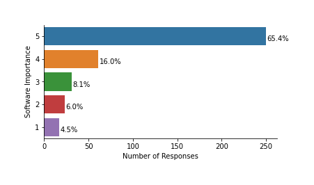

# W I P

# University of Sheffield Software Survey

## Major Findings

* 382 respondents.
* 91% of respondents use research software ([92% nationally](https://zenodo.org/record/1183562#.YMnQFahKiUk)).
* 65% report that software is vital to their research (nationally, 69% report that "It would not be practical to conduct my work without software").
* 27% develop their own code ([56% nationally](https://zenodo.org/record/1183562#.YMnQFahKiUk)).
* 69% (of the 27% subset who responded to this question) feel they have **not had sufficient training** to develop reliable software.
* Of the 54% of respondents who are involved with writing funding proposals, 45% expected to write software as part of the proposal.
* Of those who expected to write software, 40% did not request funding for this (compared to [20%, nationally](https://zenodo.org/record/1183562#.YMnQFahKiUk)).

## Recommendations

- Investigate why 69% of respondents feel they have not had sufficient training.
- Provide training / support to increase researcher confidence with version control, continuous integration and unit testing.
- Investigate why participants responded as they did to a question about level of support for software development. Create a target for this and monitor performance against it.
- Provide additional support to researchers to make research software outputs not intended for commercialisation freely available.
- Discover if any action can be taken to help researchers would like to use University of Sheffield HPC but don't currently use  to do so.
- Advocate for researchers to include costs for software development in their funding applications.

## Introduction

## Sample characteristics

- ToDo: Sampling bias in this survey and those we're comparing with. 
  - TUoS survey went to all PhD students and research staff with a prize incentive.
  - 2020 Southampton survey went to *"all staff employed on an ERE contract (Education, Research and Enterprise) and all PhD students"* with a prize incentive. As surveys were sent out on a faculty by faculty basis, it was possible to report a response rate of between 8% and 11% for all faculties.
  - 2014 national survey - it is not clear what sampling strategy was used.

If someone was a no response for one optional question, it looks like they were also a no response for all the other optional questions.

## Prevalence and importance of research software

**91% of participants report that they use research software** (defined as *"...any software you have used in the generation of a result that you expect to appear in a publication. This might be anything from a few-line script to clean some data, to a fully fledged software suite. It includes code you have written yourself and code written by someone else."* in the survey form). A 2014 study reports that [nationally this is **92%**](https://zenodo.org/record/1183562#.YMnQFahKiUk), another from the University of Southampton in 2020 [reports **95%**](https://github.com/Southampton-RSG/soton_software_survey_analysis_2019/blob/master/report/Research%20software%20at%20the%20University%20of%20Southampton.pdf).

This indicates that research software is critical for researchers at the University of Sheffield, and that this is not exceptional.

*Do you use research software?*

This is the vast majority of participants and indicates that research software is near ubiqitous amongst researchers at the University of Sheffield.

Participants were asked to express how important research software is to their work, with 1 being *"Not at all"*, and 5 *"Vital"*.

*How important is research software to your work?*

65% of participants reported that research software is vital to their work.

## Software development practise

Only 27% of our participants had developed their own code. This compares with 56% nationally. This could be because a smaller proportion of researchers at the University of Sheffield develop code than that for the whole country, or due to sampling bias in either survey. In the 2020 Southampton survey, which records an 8% to 11% response rate accross faculties, suggesting low sample bias, 33% report developing their own software - much closer to our figure. This is consistent with the national survey response having been somewhat biased towards people more engaged with software. Nonetheless, this remains a large proportion of researchers and provokes a question as to whether enough attention is given to software development in our organisation.

*Have you developed your own research software?*

The response rate for our question on self-assessment of software development expertise had a low response rate (27% responded). The use of an interval scale introduces challenges in interpretation of results between 1 which is defined as *"Beginner"* and 5, *"Professional"*.

**How do you rate your software development expertise?**

Self-assessment will lead to bias as some people will rate themselves more highly than others. However, we do not see a substantial skew towards *Beginner* or *Professional* - most respondents see themselves as somewhere in the middle.

The question of whether people have the expertise they need to do the software aspects of their research was further examined by asking about sufficiency of training.

*Do you feel that you have received sufficient training to develop reliable software?*

Again the number of responses was low (27%), but a majority felt that they had not had sufficient training. This might be because the training cannot be accessed (for a number of reasons including cost, time constraints, or not knowing about it) or is simply not available. This should be investigated further.

We asked later in the survey about confidence in (application of) specific technologies that are important for well engineered software:

- Version control
- Continuous integration
- Unit testing

Here we show results for the (27%) subset of participants that responded to these questions:

*Version control*

*Continuous integration*

*Unit testing*

It appears that in each case either a sizable minority, or a majority of respondents have either not heard of, or are not confident in each of these technologies. Due to their importance for research software engineering, this indicates more should be done to raise confidence.

The question of support for software development was raised from the perspective of what researchers get from "the university", with a 26% response rate. An interval scale between 1: *"poor"* and 5: *"excellent"* was used.

*How would you rate the university's current level of support for your software-development needs?*

Clearly, level of support provided depends hugely on resources available. And responses are subjective - we don't all have the same definition of "poor" and "excellent". The majority of responses were in the middle of the scale, but at the extremes there were more "poor" (12%) responses than "excellent" (4%). Even the best things get poor reviews sometimes - this can be more down to the reviewer than the thing.

## Funding for Software Development

We found that 44% of participants were involved in writing funding applications.

*Have you ever included costs for software development in a funding proposal?*

If we exclude those respondents not involved in writing funding applications, 45% expected to write software and of these 40% did not request funds for this.

*Have you ever included costs for software development in a funding proposal? (excluding those who not involved in writing funding proposals)*
## Staffing of software development

## High Performance Computing

Only 27% of participants responded to our question about the use of High Performance Computing (HPC) - most other optional questions had a similarly low response rate, so lack of response here should not be interpreted as lack of interest in HPC. Of those who responded, 25% did not require HPC. 

*Have you used ShARC/Bessemer, the University's high-performance computing (HPC) system?*

A broad range of possible responses were provided, here. Most important numerically were that 30% of respondents use the University of Sheffield HPC systems, and 22% would like to.

## Licensing and commercialisation

Response rate for both questions on commercialisation was 27% and results are presented as proportions of those who responded.

A minority of respondents were interested in help from "the university" with commercialising some of their research software.

*Would you be interested in the university helping you commercialise some of your research software?*

Many respondents (45%) were not interested in sharing their software with a commercial partner and a similar proportion (44%) felt that their software was not ready for this.

*Do you feel that your research software is ready to be shared with a commercial partner?*

These results suggest a situation where few participants are interested in or ready to commercialise their software. However, for some, help would be appreciated in doing so.

The [University of Sheffield's Open Research Statement](https://www.sheffield.ac.uk/openresearch/university-statement-open-research) states that researchers should *"Strive to make all scholarly outputs freely available..."* which indicates that software not intended for commercialisation should be made available. This is likely the majority of University of Sheffield research software outputs. Researchers may need additional support to realise this. There may also need to be more support for researchers who are considering, or want to commercialise their software outputs.

## Methods

## References